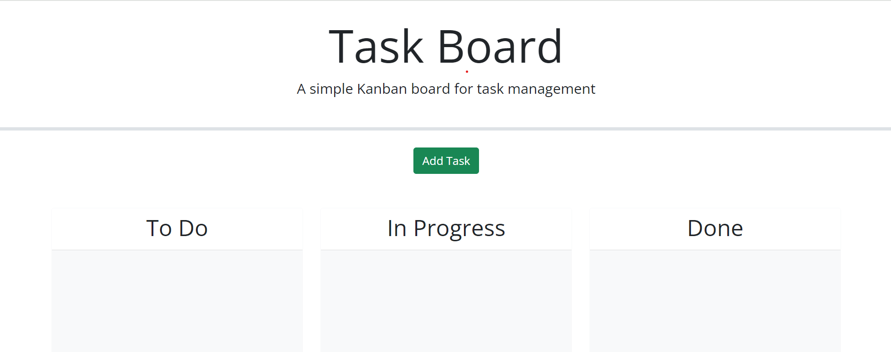

# Third-Party APIs Challenge: Task Board

## Description

This week my task was to take a starter code of a task board website and use the skills i learned this past week to make the website add task and sort them by color based on the due dates of the task.

- What was your motivation?
- Why did you build this project? (Note: the answer is not "Because it was a homework assignment.")
- What problem does it solve?
- What did you learn?

## Table of Contents

- [Usage](#usage)
- [Credits](#credits)
- [License](#license)

## Usage

<a href="https://github.com/Kadeemking/Module-5-Challenge.git">Git Hub Repo</a>

<a href="https://kadeemking.github.io/Module-5-Challenge/">Live link</a>

## Credits

<a href="https://coding-boot-camp.github.io/full-stack/github/professional-readme-guide">README Format</a> 

## License

